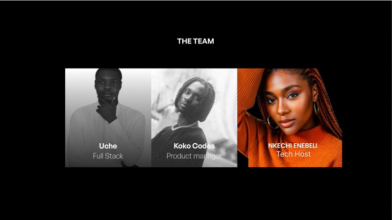

# PodFi-MVP  🌟

## Welcome to the PodFi MVP repository

  

> ## Table of contents
- [Inspiration](#inspiration)
- [What-it-does](#what-it-does)
- [How-we-built-it](how-we-built-it)
- [Technologies](#technologies)
- [Challenges-we-ran-into](challenges-we-ran-into)
- [Accomplishments-that-we're-proud-of](accomplishmentst-hat-we're-proud-of)
- [What-we-learned](what-we-learned)
- [What's-next-for-Kasheba](What's-next-for-podfi)
- [Repo Setup](#repo-setup)
- [Requirements](#requirements)
- [Setup the Project](#setup-the-project)
  - [Install Dependencies](#install-dependencies)
  - [Steps to host the live site on Vercel](#steps-to-host-the-live-site-on-vercel)
- [Live Link](#live-link)
- [Contributors](#contributors)
- [Contributing to the project](#contributing-to-the-project)

  
#
> ## Inspiration

As a content creator, sometimes I get tired of creating contents, this is not because I don’t lack the ideas or the enthusiasm, it’s rather cos I know when I create content most times, I don’t get the right engagements that I would like or the value for my content. I mean, it’s a constant case of content creators struggling to be seen. We post our contents on these platforms, it generates a lot of revenue for them but we don’t get to partake in that or even if we do, it’s only a very small fraction.

Our project, PodFi; a decentralized podcasting ecosystem built on the ethereum sepolia blockchain, was born out of this pain that I experienced as a podcast creator, but thanks to Web3, thanks to decentralization, thanks to transparency, and thanks to inclusivity, I and my team  members; Emmanuel Enebeli and Uche was able to create a product that would help tackle this challenge and make podcasting more desirable and valuable for both the creators as well as the listeners.

#
> ## What-it-does
>

### Tokenized Listener Rewards:
- Implemented a reward system where listeners earn native tokens (PodTokens) for engaging with podcasts. This includes activities like listening, sharing, and leaving comments.

### Reward Redemption:
- We make it possible for  users to redeem earned PodTokens.
Options for converting tokens to premium subscriptions, accessing exclusive content, or participating in platform events.

### Engagement Analytics:
Provides listeners with analytics on their engagement activities and earned PodTokens.
Displays trends, historical data, and potential strategies for maximizing token accumulation.

### Podcast Creators
#### Incentivizing Quality Content:
- Creators can set PodToken rewards for listeners engaging with their podcasts.
Enhanced analytics provide insights into how engagement impacts token rewards.

### Decentralized Ad Marketplace:
-  a decentralized marketplace where advertisers can directly connect with podcasters for ad placements. Smart contracts ensure transparent and fair revenue distribution between creators and advertisers.

#
> ## Technologies
| <b><u>Stack</u></b> | <b><u>Usage</u></b> |
| :------------------ | :------------------ |
| **`React`**      | Frontend     |
| **`The Graph`**      | Indexing     |
| **`Huddle01`**      | Live streaming  |
| **`Hono`**      | Backend(IPFS Proxies|

#
> ## Repo Setup

To setup the repo, first fork the podfi-muaccra Repo, then clone the forked repository to create a copy on the local machine.

    $ git clone https://github.com/Adophilus/podfi-muaccra.git

Change directory to the cloned repo and set the original podfi-muaccra repository as the "upstream" and your forked repository as the "origin" using gitbash. 

    $ git remote add upstream  https://github.com/Adophilus/podfi-muaccra.git

#

> ## Requirements
#
- Node JS

## Explainer video (User POV)

https://github.com/EnebeliEmmanuel/PodFi/assets/58889001/43876dbc-57e9-4653-8f3e-b68cf71a06db

## Useful links

- [Prensentation slides](https://www.figma.com/proto/XQ5miYBS5ZJiSwjzRk0EpW/Hack-Template---HT-OS?node-id=1-6&t=rUOu39YW5c0eN0JA-0&scaling=contain&content-scaling=fixed&page-id=0%3A1&starting-point-node-id=1%3A6)
- [Frontend Deployment]()

> ## Contributors

This Project was created by these awesome dedicated members

  

> ## What's next for PodFi
- Enhanced Tokenized Rewards System
We plan to refine and expand our tokenized rewards system to provide more engaging and diverse opportunities for both creators and listeners. This will include introducing new ways for listeners to earn PodTokens, such as through interactive polls, challenges, and exclusive content access.

- Advanced Analytics and Insights
Our team is working on developing more advanced analytics tools that provide deeper insights into listener behavior and engagement. These tools will help creators understand their audience better and tailor their content to meet listener preferences, thereby increasing retention and satisfaction.

- Decentralized Ad Marketplace Expansion
We aim to expand our decentralized ad marketplace to include more brands and advertisers. This will provide creators with greater opportunities to monetize their content and offer listeners a more personalized and relevant ad experience. The marketplace will be enhanced with improved targeting and performance tracking features.

- Partnerships and Integrations
PodFi will continue to seek strategic partnerships and integrations with other platforms and technologies to expand our reach and functionality. Collaborations with popular podcasting apps, social media platforms, and blockchain projects will be pursued to enhance the user experience and drive growth.

- Community Building and Governance
We are committed to building a strong and vibrant community around PodFi. This includes launching initiatives to increase community engagement, such as creator and listener meetups, webinars, and interactive events. Additionally, we will introduce a decentralized governance model that allows community members to have a say in the platform’s development and future direction.

#
> ## Contributing to the project

If you find something worth contributing, please fork the repo, make a pull request and add valid and well-reasoned explanations about your changes or comments.

Before adding a pull request, please note:

- This is an open source project.
- Your contributions should be inviting and clear.
- Any additions should be relevant.
- New features should be easy to contribute to.

All **`suggestions`** are welcome!
#
> ##### README Created by `Enebeli Emmanuel` for PodFi

